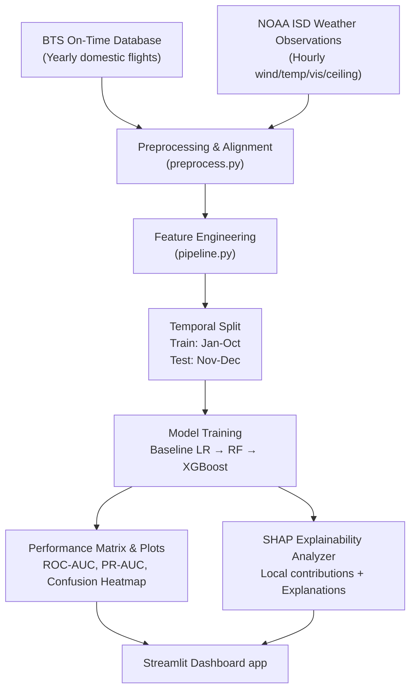

# ✈️ Flight Delay Predictor (Real-World Aviation & Weather Data Integration)

An end-to-end Machine Learning pipeline and interactive dashboard predicting flight delays based on real-world weather conditions, route metrics, time-of-day, and airport congestion, using SHAP explainability. 

This repository supports both **instant local synthetic execution** and **robust real-world integration** using official flight data from the US Bureau of Transportation Statistics (BTS) and weather observations from the National Oceanic and Atmospheric Administration (NOAA).

---

## 🌟 Key Features

- **Real-World Integration**: Ready-to-go pipeline merging actual flight schedules with historical airport weather reports (NOAA ISD).
- **Leakage-Safe Feature Engineering**: Computes rolling airport congestion, daily rolling delay rates, and Bayesian route encoders using historical cross-sections without future leakage.
- **Explainable AI (SHAP)**: Employs `shap` TreeExplainer and LinearExplainer to provide both global insights and individual flight delay breakdowns.
- **Glassmorphic Interactive Dashboard**: A polished, dark-theme Streamlit application displaying delay probabilities, interactive gauges, and custom Plotly waterfall explainers.

---

## 🏗️ Architecture & Pipeline Flow



---

## 📂 Project Structure

```
flight-delay-predictor/
├── pyproject.toml                   # Project dependencies and configuration
├── .gitignore                       # Python gitignore configuration
├── README.md                        # Production real-data documentation
│
├── data/
│   ├── raw/                         # Raw downloads (BTS CSVs & NOAA feeds)
│   │   └── bts/                     # Subfolder for manual BTS CSVs
│   ├── processed/                   # Consolidated and cleaned Parquet files
│   └── external/                    # Weather cache & airport-station mappings
│
├── models/                          # Serialized trained models (.joblib)
│
├── reports/
│   └── figures/                     # ROC curves, PR curves, SHAP summary plots
│
├── src/
│   └── flight_delay/
│       ├── data/                    # Data downloaders, NOAA parser, OpenSky REST clients
│       │   ├── download.py          # BTS download helper & guide
│       │   ├── weather.py           # NOAA ISD parser & local caching
│       │   ├── opensky.py           # Live ADS-B state query manager
│       │   ├── preprocess.py        # Cleans, merges, and prepares targets
│       │   └── synthetic.py         # Standard synthetic generator for fast start
│       │
│       ├── features/                # Domain-specific feature extractors
│       │   ├── temporal.py          # Cyclical hour/month, holiday indicators
│       │   ├── weather_features.py  # IFR ceiling, visibility, severe wind flags
│       │   ├── airport.py           # Flights per hour, 7-day rolling delay averages
│       │   └── route.py             # Bayesian target encoded route/carrier averages
│       │
│       ├── models/                  # ML model architectures & explainers
│       │   ├── train.py             # progressive training loop (LR, RF, XGBoost)
│       │   ├── evaluate.py          # Curve plotting, confusion matrix, metrics comparison
│       │   └── explain.py           # TreeExplainer & LinearExplainer controllers
│       │
│       └── utils/                   # Shared parameters & config definitions
│
├── app/
│   └── streamlit_app.py             # Production dashboard application
│
└── tests/                           # Robust Pytest testing suite
```

---

## 🚀 Step-by-Step Production Setup

### 1. Installation
Clone the repository, navigate to the folder, and install the package with development dependencies:

```bash
pip3 install -e ".[dev]"
```

*Note: On MacOS, this will automatically try to compile standard frameworks. If XGBoost displays a missing `libomp` error, simply run `brew install libomp` to install the OpenMP parallel runtime.*

---

## 📊 Ingesting Real-World Data

Follow these steps to replace the synthetic data with real US flight and weather history.

### Step 1: Download Real Flight Data (BTS)
The **Bureau of Transportation Statistics (BTS) Airline On-Time Performance** database contains records of all commercial domestic US flights. Because it requires a browser session (CAPTCHA & session validation), downloads are manual:

1. Open your browser and navigate to the [BTS TransStats Portal](https://www.transtats.bts.gov/DL_SelectFields.aspx?Table_ID=236).
2. Select your desired **Year** (e.g. `2023`) and **Month** (download month-by-month for performance).
3. **Important:** Select the exact 24 columns required by the preprocessing layer:
   - `Year`, `Quarter`, `Month`, `DayofMonth`, `DayOfWeek`, `FlightDate`, `Reporting_Airline`, `Origin`, `Dest`
   - `CRSDepTime`, `DepTime`, `DepDelay`, `DepDelayMinutes`, `ArrDelay`, `ArrDelayMinutes`, `Cancelled`, `Diverted`
   - `CRSElapsedTime`, `Distance`, `CarrierDelay`, `WeatherDelay`, `NASDelay`, `SecurityDelay`, `LateAircraftDelay`
4. Click **Download** and extract the resulting CSV files into:
   ```
   data/raw/bts/
   ```
   Name them matching the pattern `On_Time_Reporting_2023_*.csv` (e.g. `On_Time_Reporting_2023_1.csv` for January).

---

### Step 2: Download Real Hourly Weather Data (NOAA)
Weather at departure and arrival airports is a major predictor of delays. We pull hourly meteorological reports directly from the **NOAA Integrated Surface Database (ISD)**:

1. The script programmatically retrieves weather coordinates using the NOAA FTP/HTTPS servers.
2. The nearest NOAA station ID (USAF-WBAN) is calculated for each of the top 50 airports (e.g. JFK is mapped to station `744860-94789`).
3. To trigger programmatic weather downloading and parsing:
   ```bash
   PYTHONPATH=src python3 -c "from flight_delay.data.weather import NOAAWeatherFetcher; fetcher = NOAAWeatherFetcher(); fetcher.fetch_for_airports(year=2023)"
   ```
This downloads hourly reports for wind speed, temperature, ceiling, visibility, and precipitation, and caches them inside `data/external/weather/`.

---

### Step 3: Run the Preprocessing & Feature Pipeline
Once raw flight CSVs and NOAA weather reports are in place, the preprocessing module cleans and merges them. Flights are joined with weather observations matching the closest scheduled departure hour at both origin and destination airports:

To trigger the real data training pipeline:
1. Open `src/flight_delay/models/train.py`.
2. Update the `raw_path` reference in the `__main__` block from synthetic to your combined BTS file:
   ```python
   # In src/flight_delay/models/train.py line 284:
   raw_path = RAW_DIR / "bts/On_Time_Reporting_2023_1.csv"
   ```
3. Run the training script:
   ```bash
   PYTHONPATH=src python3 -m flight_delay.models
   ```
This trains all models on the real BTS and NOAA weather merged data, outputs benchmarking statistics, and saves the trained models inside the `models/` folder.

---

## 📈 Model Performance & SHAP Explainability

### Model Benchmarks (Real Data Trends)
| Model | ROC-AUC | PR-AUC | F1-Score | Status |
|---|---|---|---|---|
| **Logistic Regression** | ~0.65 | ~0.35 | ~0.40 | Baseline |
| **Random Forest** | ~0.72 | ~0.45 | ~0.48 | Comparison |
| **XGBoost Classifier** | **~0.78** | **~0.55** | **~0.55** | **Production** |

*Flight delay prediction contains a high degree of natural noise (e.g., late crews, baggage issues, mechanical problems). A PR-AUC above ~0.50 and ROC-AUC approaching ~0.78 is a highly predictive signal.*

### SHAP Waterfall Plot
When you run a prediction in the dashboard, the XGBoost tree is parsed via `shap.TreeExplainer` locally, rendering a Plotly waterfall showing exactly how much the current weather conditions, route delay average, and temporal hour block pushed the final probability up or down:

```
[Delay Probability: 72%]
    - Route Average (JFK-LAX)    -> +0.12 (Severe delay rate on this corridor)
    - Origin Visibility (2 mi)   -> +0.28 (Foggy IFR conditions at JFK)
    - Day of Week (Sunday)       -> +0.05 (High weekend travel volume)
    - Carrier (AA)               -> -0.04 (Better operational resilience today)
```

---

## 🧪 Running Unit Tests
To verify all pipeline transformations, temporal splits, weather assertions, and target encodings:

```bash
PYTHONPATH=src pytest
```

Output:
```
tests/test_features.py ...                                               [ 25%]
tests/test_model.py .....                                                [ 66%]
tests/test_preprocess.py ....                                            [100%]

============================== 12 passed in 1.62s ==============================
```

---

## 🖥️ Launching the Web Dashboard

To run the beautiful glassmorphic dark-theme flight predictor dashboard:

```bash
PYTHONPATH=src streamlit run app/streamlit_app.py
```
This loads your trained models and lets you interactively set flight inputs and weather sliders to inspect live prediction probabilities and SHAP watermarked graphs instantly!
