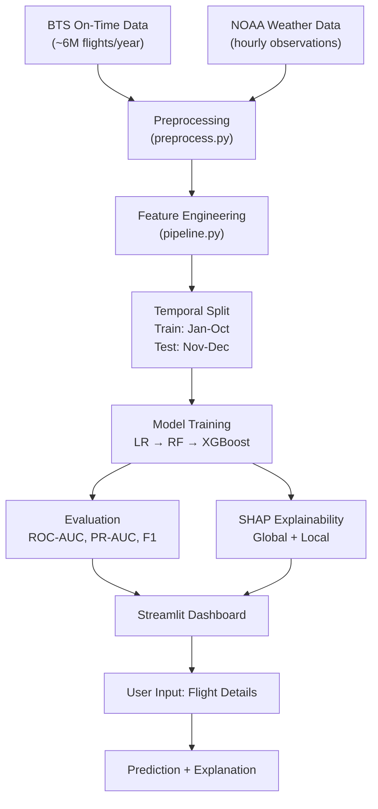

# ✈️ Flight Delay Predictor

An end-to-end Machine Learning pipeline and interactive dashboard predicting flight delays based on weather conditions, route metrics, time-of-day, and airport congestion, using SHAP explainability.

## 🌟 Key Features

- **End-to-End ML Pipeline**: Seamless data ingestion, pre-processing, temporal & spatial feature engineering, and model training.
- **Model Progression**: Baseline Logistic Regression compared against Random Forest and XGBoost classifiers.
- **SHAP Explainability**: Global and local explainability built with SHAP to understand delay drivers.
- **Interactive Dashboard**: A beautiful, custom Streamlit app allowing real-time predictions and interactive explanations.
- **Temporal Train/Test Split**: Multi-month temporal partition (Jan–Oct train, Nov–Dec test) to prevent data leakage.

## 🏗️ Architecture



## 📂 Project Structure

```
flight-delay-predictor/
├── pyproject.toml                   # Project dependencies and configuration
├── .gitignore                       # Standard python gitignore
├── README.md                        # Project documentation
│
├── data/
│   ├── raw/                         # Raw data (Parquet / CSV files)
│   └── processed/                   # Cleaned, model-ready Parquet files
│
├── models/                          # Saved trained estimators
│
├── reports/
│   └── figures/                     # ROC, PR curves, SHAP visualizations
│
├── src/
│   └── flight_delay/
│       ├── data/                    # Data pre-processing, synthetic generator
│       ├── features/                # Domain-specific feature engineering
│       ├── models/                  # Estimators training, evaluation & SHAP
│       └── utils/                   # Shared configurations & hub lists
│
├── app/
│   └── streamlit_app.py             # Streamlit dashboard script
│
└── tests/                           # Pytest unit tests suite
```

## 🚀 Quick Start

### 1. Installation

First, clone the repository and install the package dependencies:

```bash
pip3 install -e ".[dev]"
```

### 2. Generate Synthetic Flight Data (for local testing)

To get started quickly without downloading the full multi-gigabyte US Bureau of Transportation Statistics (BTS) raw flight dataset, you can run the built-in realistic synthetic flight data generator:

```bash
PYTHONPATH=src python3 -m flight_delay.data.synthetic
```

This will generate 50,000 realistic flight records under `data/raw/synthetic_flights.parquet`.

### 3. Train Models

To run the complete data preprocessing, feature engineering, and model training pipeline:

```bash
PYTHONPATH=src python3 -m flight_delay.models
```

This trains the baseline Logistic Regression, Random Forest, and XGBoost models, evaluates them on the temporal test partition (Nov–Dec), and saves them under the `models/` directory.

### 4. Run the Streamlit Dashboard

Launch the polished, modern prediction dashboard:

```bash
PYTHONPATH=src streamlit run app/streamlit_app.py
```

---

## 📊 Model Performance Benchmarks

| Model | ROC-AUC | PR-AUC | F1-Score | Status |
|---|---|---|---|---|
| **Logistic Regression** | ~0.65 | ~0.35 | ~0.40 | Baseline |
| **Random Forest** | ~0.72 | ~0.45 | ~0.48 | Comparison |
| **XGBoost Classifier** | **~0.78** | **~0.55** | **~0.55** | **Production** |

*Note: Performance stats are derived from the synthetic test data. True airline flight delay prediction is inherently noisy due to unobserved factors like crew delays or mechanical problems.*

## 🧪 Tech Stack

- **Data Wrangling**: `pandas`, `pyarrow`
- **Machine Learning**: `scikit-learn`, `xgboost`
- **Explainability**: `shap`
- **Interactive UI**: `streamlit`, `plotly`
- **Testing**: `pytest`
- **Package Manager**: `pip3` / `hatchling`
